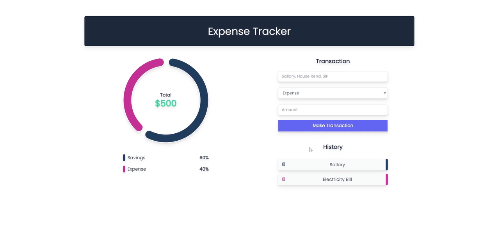

# Budget Bee 🐝

**Budget Bee** is a user-friendly expense management application designed to help you track, organize, and manage your finances efficiently. Stay on top of your spending and achieve your financial goals with ease! 

---

## Features 📊

- **Expense Tracking**: Add, edit, and delete your expenses with just a few clicks.
- **Category Management**: Organize your expenses into customizable categories.
- **Budget Goals**: Set monthly or weekly budget goals to manage your spending.
- **Visual Insights**: Interactive charts and graphs to analyze your spending patterns.
- **Expense History**: View and filter your past expenses by date or category.
- **Secure and Private**: Your financial data stays private and secure.

---

## Tech Stack 🛠️

- **Frontend**: React, Tailwind CSS
- **Backend**: Node.js, Express
- **Database**: MongoDB
- **Authentication**: JSON Web Tokens (JWT)
- **APIs**: RESTful APIs

---

## Installation & Setup 📖

Follow these steps to set up and run the project locally:

### Prerequisites 
- Node.js (v14+)
- MongoDB
- Git

### Steps
1. **Clone the Repository**:
   ```bash
   git clone https://github.com/your-username/budget-bee.git
   cd budget-bee
   ```

2. **Install Dependencies**:
   ```bash
   npm install
   ```

3. **Set Up Environment Variables**:
   Create a `.env` file in the root directory and configure the following:
   ```env
   MONGO_URI=your-mongodb-connection-string
   JWT_SECRET=your-secret-key
   PORT=5173
   ```

4. **Run the Application**:
   ```bash
   npm start
   ```
   The app will be available at [http://localhost:5000](http://localhost:5000).

---

## Screenshots 🎨

| Feature            | Screenshot                                    |
| ------------------ | --------------------------------------------- |
| Dashboard Overview |      |
| Add Expense        |  |
| Add Expense        |  |

---

## Contribution Guidelines 🤝

We welcome contributions to make **Budget Bee** better! 

### Steps to Contribute
1. Fork the repository.
2. Create a new branch: `git checkout -b feature/your-feature-name`
3. Commit your changes: `git commit -m 'Add some feature'`
4. Push to the branch: `git push origin feature/your-feature-name`
5. Create a pull request.

---
  
--- 
 
**Happy Budgeting with Budget Bee! 🐝**
